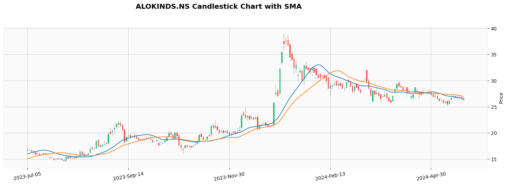

# Practical Notebooks


Welcome to my repository of geospatial data science projects! This collection houses a variety of my data science and geospatial notebooks and python scripts, which serve as a testament to my proficiency and knowledge in this field. Each project showcases various facets of data analysis, machine learning, and visualization techniques.

```tags```: python, data-science, jupyter-notebook, ipython-notebook, exploratory-analysis, geospatial


# Projects

<table>
  <tbody align="center">
    <tr>
      <td>
        <a href="stock_price_forecasting.ipynb" target="_blank">
          <h4>Stock Price Forecasting</h4>
          
        </a>
        <p>It uses Yahoo Finance stock data to forecast stock prices using ARIMA and SARIMAX model. The EDA analysis and step-by-step implementation of these two models presented in Jupyter Notebook</p>
      </td>
      <td >
        <a href="" target="_blank">
          <h4>ArcGIS Python Scripts Examples</h4>
          
        </a>
        <p>Several Python scripts written using arcpy module for the purpose of learning. It helps us the use of arcpy module. An add-in button example also added to this repositary.</p>
      </td>
    </tr>
  </tbody>
</table>


# Contributing
We welcome contributions! If you wish to contribute to this repository, kindly adhere to the guidelines provided below. We greatly appreciate any enhancements, bug fixes, or additional projects.

- Fork the repository to your GitHub account
- Establish a fresh branch for your modifications or contributions
- Implement your alterations, improvements, or repairs in your branch
- Verify your modifications to guarantee they do not cause any problems
- Record your modifications with a concise and detailed commit message
- Upload/Push your modifications to your forked repository
- Finally, submit a pull request to the main repository


# Reference Data Science Projects
- [Data Science Machine Learning Project with Source Code](https://github.com/durgeshsamariya/Data-Science-Machine-Learning-Project-with-Source-Code)
- [Data Science Projects](https://github.com/SUKHMAN-SINGH-1612/Data-Science-Projects)
- [Data Science Projects](https://github.com/yusufcinarci/Data-Science-Projects)
- [500 AI Machine learning Deep learning Computer vision NLP Projects with code](https://github.com/ashishpatel26/500-AI-Machine-learning-Deep-learning-Computer-vision-NLP-Projects-with-code)

# Other References
- [Free Stock Photos](https://freestocks.org/)